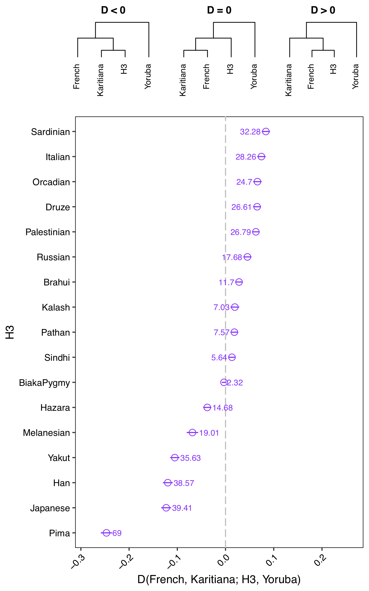
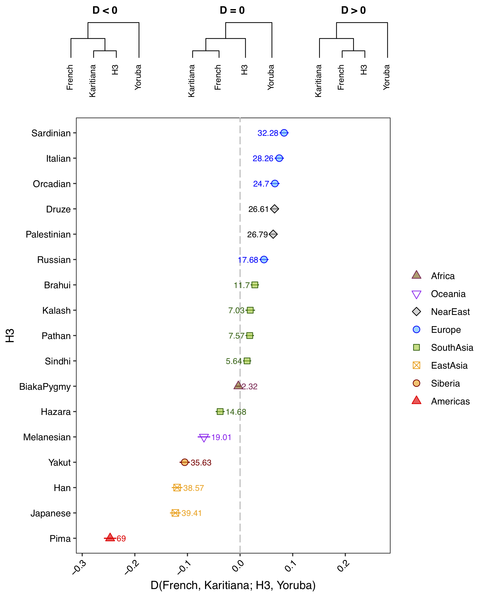
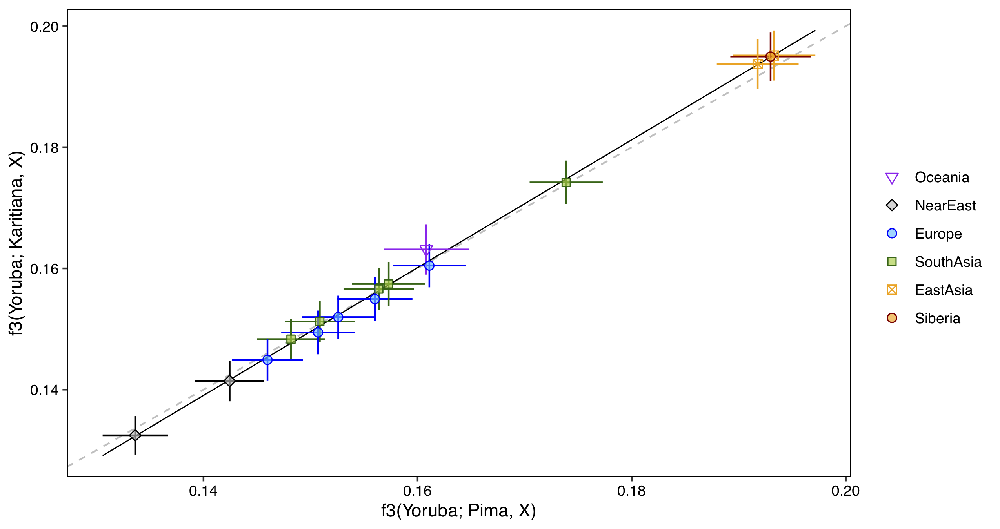
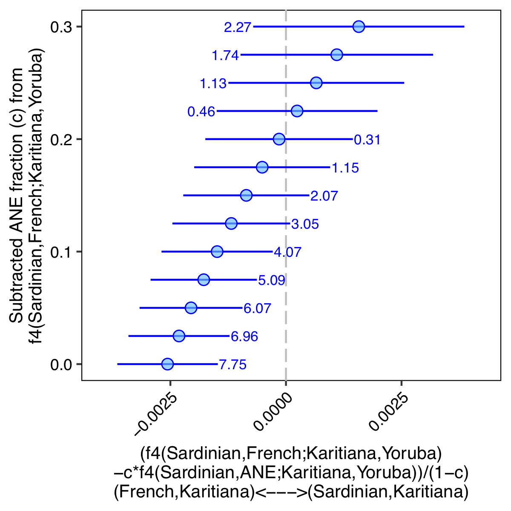
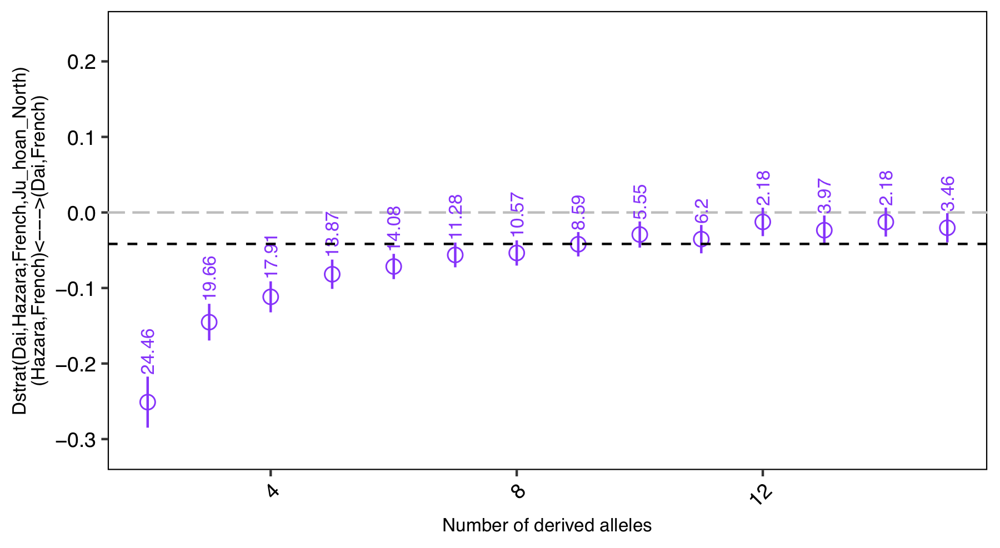
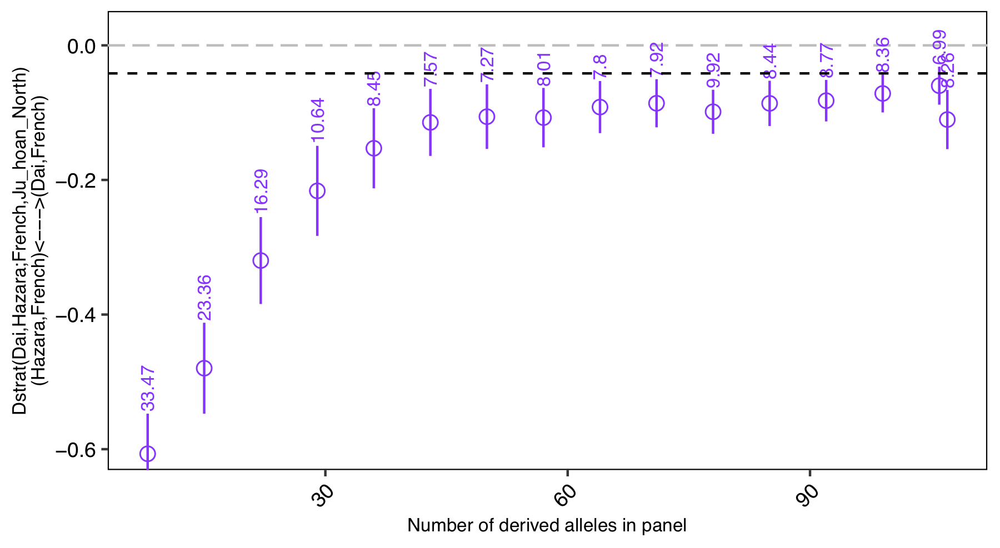

# Frequency-based Analysis ToolKit (FrAnTK)

# Table of contents
[Introduction](#SecIntroduction)

[Citation](#SecCitation)

[Requirements](#SecRequirements)

[Getting started](#SecGettingStarted)

[Master wrapper](#SecMasterWrapper)

[Precomputing allele frequencies](#SecPrecomputingAlleleFrequencies)

[Computing a single statistic](#SecComputingASingleStatistic)

[Single statistics output](#SecSingleStatisticsOutput)

[Run multiple tests automatically](#SecRunMultipleTestsAutomatically)

[Plotting](#SecPlotting)

[Re-plotting](#SecRePlotting)

[Pairwise f3-statistics](#SecPairwiseF3Statistics)

[Adding sequencing data (`addBams.py`)](#SecAddingSequencingData)

[Adding sequencing data 2 (`bam2plink.py`)](#SecAddingSequencingData2)

[Adding sequencing data without a genotype reference dataset (`BuildDummyFreqs.py`)](#SecAddingSequencingData3)

[f4-ratios](#SecF4Ratios)

[Admixture/contamination subtracted f4-statistics](#SecAdmixtureContaminationSubtractedF4Statistics)

[Enhanced D-statistics](#SecEnhancedDStatistics)

[Derived allele count-stratified D-statistics](#SecDerivedAlleleCountStratifiedDStatistics)

[Freqs to Treemix format conversion](#SecFreqsToTreemixFormatConversion)

<a name="SecIntroduction"></a>
# Introduction

FrAnTK is a toolkit for efficiently exploring allele sharing patterns in genomic SNP variation datasets using frequency-based statistics, 
e.g., [f-statistics](https://www.genetics.org/content/192/3/1065). We provide scripts for computing single statistics, together with multithreaded 
wrappers for automating tests across large datasets. These wrappers also include plotting functions for visualising multiple tests at the same time. 
Additionally, FrAnTK provides a set of scripts for merging low-depth sequencing data (usually ancient DNA data) into genome-wide SNP datasets for 
subsequent joint analyses of both data types. 

Our scripts are user friendly and should allow users with limited programming experience or limited familiarity with a UNIX system to explore 
their own datasets efficiently. =)

# Citation
<a name="SecCitation"></a>
https://academic.oup.com/g3journal/advance-article/doi/10.1093/g3journal/jkab357/6395361?login=true

<a name="SecRequirements"></a>
# Requirements
- python (>=2.7) (SHOULD work with python3, but most testing has been done with python2.7)

- perl

- R and Rscript (>=3) https://cran.r-project.org

- plink (>=1.9) https://www.cog-genomics.org/plink/

- samtools (>=1) http://www.htslib.org

- doParallel, ggplot2, grid R packages. These can be installed by running the following in R.
```
install.packages("doParallel")
install.packages("ggplot2")
install.packages("grid")
```

<a name="SecGettingStarted"></a>
# Getting started

Before 'building' the scripts, make sure plink and samtools are available by just typing `plink` or `samtools`. 
If you usually call plink or samtools with their full path, e.g., `/my/path/to/plink --bfile ...` or 
`/my/other/path/to/samtools view ...`, just add these paths to your `$PATH` variable like this:

```
export PATH=/my/path/to/plink:$PATH
export PATH=/my/other/path/to/samtools:$PATH
```
You can add these lines to your `~/.bashrc` file to make the setup 'permanent'.

Besides this, installing should be relatively simple. 

First we specify the python, perl and Rscript locations. python and perl are usually located in `/usr/bin`, 
but the location of Rscript might vary. If you are not sure, you can use `which` to get their locations in your system, like this:

```
which perl
which python
which Rscript
```
Once you know those locations, just run the following by replacing `/my/path/to/` with the paths in your own system:

```
export pythonpath=/my/path/to/python
export perlpath=/my/path/to/perl
export Rpath=/my/path/to/Rscript
```

Finally, go to the `src` directory and 'build' the scripts. (Note there is an extra step for macOS users below)
```
cd src
sh BuildBin.sh
```
In case you are working on a mac, you have to run one extra step after `sh BuildBin.sh`. (This edits some python scripts since gzip is 
a bit different in macOS) 
```
sh BuildMacBin.sh
```

After 'building' you will be suggested to add the new bin dir to your $PATH variable. Doing so will make a 'permanent' setup. Otherwise
you must type the following everytime you run the scripts (replacing with your own path).
```
export PATH=/my/path/to/frantk/distr/bin:$PATH
```

<a name="SecMasterWrapper"></a>
# Master Wrapper
As of October 2021, FrAnTK includes a master wrapper that provides a straightforward, centralised way to call and get help for the main tools. You can run
```
frantk
```
without arguments to get a general description. 

Throughout the documentation, we show how to use each of the FrAnTK scripts separately. These remain exactly the same, but now all commands 
can ALSO be accessed through the master wrapper. For example, to compute an [f3-statistic or a D-statistic with `getf3.py` and `getD.py`](#SecComputingASingleStatistic) we would run: 
```
getf3.py h1=popnameh1 h2=popnameh2 target=popnametarget freqpref=prefix
getD.py h1=popnameh1 h2=popnameh2 h3=popnameh3 h4=popnameh4 freqpref=prefix
```
The equivalent commands with the new wrapper would look like this: 
```
frantk getf3 h1=popnameh1 h2=popnameh2 target=popnametarget freqpref=prefix
frantk getD h1=popnameh1 h2=popnameh2 h3=popnameh3 h4=popnameh4 freqpref=prefix
```

<a name="SecPrecomputingAlleleFrequencies"></a>
# Precomputing allele frequencies 
**IMPORTANT**: You can find some example datasets you can use to test the general functionality under the `example` dir. `example/test.*`
contains a random subset (100k sites and 480 individuals) of the [HGDP](https://science.sciencemag.org/content/319/5866/1100) SNP array data. 

We start with a [bed-bim-fam plink file](https://www.cog-genomics.org/plink/1.9/formats#bed) containing your data. Using that dataset, we will compute statistics that rely on allele frequencies. In order to speed up the process (and so it is not done every time), we precompute those frequencies like this 

```
BuildFreqs.py plinkpref=test clustfile=test_clust npops=20 prefout=testfrq
```
You can get help by typing `BuildFreqs.py` without arguments, but take a look at the pointers below:

- `test_clust` contains a **tab-separated** table specifying which individuals belong to which population. <br/>
The first two columns correspond to the first two columns in `test.fam`. <br/>
The third column defines the population to which each individual belongs. <br/>
The fourth column may be 0 or 1. Set to 0 when an individual has diploid genotypes, and set to 1 when an individual has pseudo-haploid 
genotypes (standard for low-depth ancient DNA data). **IMPORTANT**: The ploidy of all individuals in a population should be the same. If 
different values are specified, the ploidy of the pop is set to the most frequent value (diploid for ties). 

- `npops` is the number of different populations in the data. We can get this number by running
```
cut -f 3 test_clust | sort | uniq | wc -l
```

`BuildFreqs.py` will create four output files, all starting with `prefout` (testfrq in the case of the example):

- `prefout_freqs.gz` contains the actual allele frequencies per population, per site (one site per row). The first five columns correspond to the .bim
file. The following columns are organised in per-population triplets. The first element of the triplet is the allele frequency of the allele in column 4. The second and third elements are the allele counts of the alleles in columns 4 and 5 respectively. 

- `prefout_pop` contains the population names included in the dataset. Triplets in `prefout_freqs.gz` are ordered according to this file.

- `prefout_regions` is an extended [bed file](https://en.wikipedia.org/wiki/BED_(file_format)) (not to be confused with a .bed plink file) containing the coordinates of each site in the dataset. 

- `prefout_chrs` is a tab-separated list with the ordered names of the chromosomes in the dataset and their respective lengths (in bp). Similar to the first two columns of a [.fai file](http://www.htslib.org/doc/faidx.html). Columns 3 and 4 are first and last lines of each contig (useful for subsetting and sorting). 

**Note:** In case the reference data were provided in a vcf file instead of a plink file, we can obtain a suitable plink file with bi-allelic SNPs using plink. For example: 
```
plink --vcf VCFFILENAME --double-id --snps-only --set-all-var-ids @:# --maf 0.000001 --make-bed --out PLINKFILENAME
```

<a name="SecComputingASingleStatistic"></a>
# Computing a single statistic

These are scripts for running single tests (feel free to request new scripts)

- `getf3.py` Compute f3-statistics of the form f3(h1, h2; target), using definition and normalization in [Patterson et al, 2012](https://www.genetics.org/content/192/3/1065). Normalization and het. correction can be disabled by using `singlehapout=1` (useful for 'outgroup f3-stats' where the target pop is represented by a **single pseudo-haploid individual**). Wrapper: `autof3wfixed.R` and `autoPWf3wfixed.R`. 
- `getD.py` Compute D-statistics of the form D(h1, h2; h3, h4), using definition and normalization in [Patterson et al, 2012](https://www.genetics.org/content/192/3/1065). Wrapper: `autoDwfixed.R`. 
- `getF4.py` Compute f4-statistics of the form D(h1, h2; h3, h4), using definition and normalization in [Patterson et al, 2012](https://www.genetics.org/content/192/3/1065). Wrapper: `autoDwfixed.R`. 
- `getF4Ratio.py` Compute f4-ratio of the form f4(h1, h4; x, h3)/f4(h1, h4; h2, h3), using definition in [Patterson et al, 2012](https://www.genetics.org/content/192/3/1065) [f4(A, O; x, C)/f4(A, O; B, C)]. We assume x is admixed between pops related to h2 (B) and h3 (C); and h1 (A) forms a clade with h2. 
- `getF4subtr.py` Compute admixture subtracted F4 statistics of the form (f4(h1, h2; h3, h4)-padm\*f4(h1, x; h3, h4))/(1-padm), using definition in [Reich et al. 2012](https://www.nature.com/articles/nature11258). Wrapper: `autof4subtr.R`. 
- `getPWdist.py` Compute pairwise distance between 2 pops, defined as the average of p_h1\*q_h2+q_h1\*p_h2 over all sites. Wrapper: `autoPWdistwfixed.R`. 
- `getEnhD.py` Compute enhanced D-statistics of the form D(h1, h2; h3, h4) [(Meyer et al, 2012)](https://science.sciencemag.org/content/338/6104/222). We restrict to sites where h4 is invariant for one allele. Works better with many sites and not too many individuals/populations with very different ancestries in h4. Wrapper: `autoDEnhwfixed.R`. 
- `getDstrat.py` Compute D-statistics of the form D(h1, h2; h3, h4), on sites where there are (minder, maxder] derived alleles in h1+h2+h3+h4. Similar to what is done in [Prüfer et al, 2013](https://www.nature.com/articles/nature12886), but we pick segregating sites in h1+h2+h3+h4. Wrapper: `autoDstrat.R`. 
- `getDstrat2.py` Compute D-statistics of the form D(h1, h2; h3, h4), on sites where there are (minder, maxder] derived alleles in the complete panel (freqpref). Similar to what is done in [Prüfer et al, 2013](https://www.nature.com/articles/nature12886), but we pick segregating sites in the complete panel. Wrapper: `autoDstrat.R`.
- `getDtrip.py` Compute the three possible arrangements of D(h1, h2; h3, h4), using definition and normalization in [Patterson et al, 2012](https://www.genetics.org/content/192/3/1065). 

NOTE: There is also ‘NT’ versions of the scripts, e.g., `getDNT.py` in which transition snps (c-t and g-a) are excluded. This is especially useful when dealing with ancient DNA sequencing data. 

You can get help by typing any of the above without arguments. A usual run would look like this:

```
getD.py freqpref=testfrq h1=Sardinian h2=French h3=Karitiana h4=Yoruba
```

<a name="SecSingleStatisticsOutput"></a>
## Single statistics output

By default, the output of the above scripts is written into a directory named `./res`. You can specify the output 
directory using the `resdir` option. 

All output files are **tab-separated** and contain: 
- population names in the first columns. 
  - h1, h2 for pairwise distances
  - h1, h2, target for f3
  - h1, h2, h3, h4 for D and f4
  - h1 (A), h2 (B), h3 (C), h4 (O), x (the B+C=X admixed population) for f4-ratio
  - h1, h2, h3, h4, x (the population that admixes into h2) for f4subtr
- the statistic of interest (e.g., f3, D, pairwise distance)
- standard error as estimated from a weighted block-jackknife
- Z-score (statistic of interest/std.error)
- the number of snps used for computation
- the number of blocks used for jackknife
- a logical flag (used for [plotting](#SecPlotting))
- a category (also used for [plotting](#SecPlotting)) 
- D and f4 output files contain two additional columns with the expected counts of ABBA and BABA sites

<a name="SecRunMultipleTestsAutomatically"></a>
# Run multiple tests automatically

Usually, we are interested in exploring how one particular population relates to all other populations in the dataset. We can use 
the `auto*wfixed.R` scripts to fix one (for pairwise distances), two (for f3) or three populations (for f4 and D-statistics). These 
scripts are wrappers for the `get*.py` scripts, that will also produce some useful plots. Run them without arguments to get some help. 

Output files for each test will be placed in a new directory inside the current working directory. A concatenated results text file 
and a plot, will be placed in the current working directory. Here's some examples. Note there is a `nthr` parameter which determines how many 
tests are run in parallel. 

```
autoPWdistwfixed.R h2=Karitiana freqpref=testfrq nthr=10
autoPWdistwfixed.R h2=Karitiana freqpref=testfrq nthr=10 rmtrns=1

autof3wfixed.R h1=Sardinian target=Yoruba freqpref=testfrq nthr=10
autof3wfixed.R h1=Sardinian target=Yoruba freqpref=testfrq nthr=10 rmtrns=1

autoDwfixed.R h1=French h2=Karitiana h4=Yoruba freqpref=testfrq nthr=10
autoDwfixed.R h1=French h2=Karitiana h4=Yoruba freqpref=testfrq nthr=10 rmtrns=1
```

`autoDwfixed.R` should get you a figure similar to this:

<p align="center">

</p>

<a name="SecPlotting"></a>
# Plotting

`auto*wfixed.py` scripts have two optional arguments `catfile` and `legfile`. With these files, we can control the 
colors and symbols in the plots. 

A category file is a **tab-separated** file specifying a "category" for each population. The 
first column of the table corresponds to the populations in the panel (see `_clust` file used for 
[pre-computing allele frequencies](#SecPrecomputingAlleleFrequencies)) and the second column 
corresponds to a user-specified category. Default category 'Other' is assigned to populations that are not present in this file. 

A legend file is a **tab-separated** file specifying color and symbol for each category. The first column is a category name (specified 
in the category file), the second column is an R color name (outer color for filled symbols), third column is an R color name (inned color
for filled symbols) and fourth column is an R pch number. Random colors and pchs are chosen for categories not present in the file. 
You can get a list of R color names here [R colors](http://www.stat.columbia.edu/~tzheng/files/Rcolor.pdf), and a list of R pch 
numbers here [R pch](http://www.sthda.com/english/wiki/r-plot-pch-symbols-the-different-point-shapes-available-in-r). Note that 
the order of the entries in the legend file is the same order of the legend in the plot. 

Try running the tests above, but this time with a category file and a legend file.

```
autof3wfixed.R h1=Sardinian target=Yoruba freqpref=testfrq nthr=10 catfile=cats.txt legfile=legend.txt
autof3wfixed.R h1=Sardinian target=Yoruba freqpref=testfrq nthr=10 catfile=cats.txt legfile=legend.txt rmtrns=1

autoDwfixed.R h1=French h2=Karitiana h4=Yoruba freqpref=testfrq nthr=10 catfile=cats.txt legfile=legend.txt
autoDwfixed.R h1=French h2=Karitiana h4=Yoruba freqpref=testfrq nthr=10 catfile=cats.txt legfile=legend.txt rmtrns=1

autoPWdistwfixed.R h2=Karitiana freqpref=testfrq nthr=10 catfile=cats.txt legfile=legend.txt
autoPWdistwfixed.R h2=Karitiana freqpref=testfrq nthr=10 catfile=cats.txt legfile=legend.txt rmtrns=1
```

Running `autoDwfixed.R` should get you a plot similar to this:

<p align="center">

</p>


<a name="SecRePlotting"></a>
# Re-plotting

You can run the `auto*wfixed.R` scripts without any category or legend files, and include them later on without re-computing all tests. 
To do so just re-run using the `resfile` argument (the concatenated output `.txt` file), together with a `catfile` and a `legfile`. 
It is also possible to decide which populations will be included in the plot by editing the concatenated output `.txt.` 
Simply set the ‘Plot’ column to FALSE (capitalisation is important) to exclude a given test. For example, we can run a cmd like this
```
autof3wfixed.R h1=Sardinian target=Yoruba freqpref=testfrq nthr=10
```
and pass the output to `autof3wfixed.R` through `resfile` together with a catfile and a legfile to get a nicer plot. (Remember to change the 'XXXXXX' string when you run the example)
```
autof3wfixed.R resfile=Results_f3__h2_Sardinian_Yoruba_testfrq_XXXXXX.txt catfile=cats.txt legfile=legend.txt
```

<a name="SecPairwiseF3Statistics"></a>
# Pairwise f3-statistics

We also provide a wrapper for comparing f3-statistics vectors (obtained through `autof3wfixed.py`) for two different populations x and y 
(e.g., FigS26 in [Raghavan et al, 2013]((https://www.nature.com/articles/nature12736))). The script calls `autof3wfixed.py` for each 
of the two populations. It then feeds both outputs to `PlotPairwiseOutF3.R` to make a biplot, compute a linear regression and plot the 
standardized residuals. Try these examples. (Remember to change the 'XXXXXX' string when you run the example)

```
autoPWf3wfixed.R freqpref=testfrq x=Pima y=Karitiana target=Yoruba nthr=4  catfile=cats.txt legfile=legend.txt

PlotPairwiseOutF3.R xfile=Results_f3__h2_Pima_Yoruba_testfrq_XXXXXX.txt yfile=Results_f3__h2_Karitiana_Yoruba_testfrq_XXXXXX.txt x=Pima y=Karitiana target=Yoruba legfile=legend.txt pref=ResultsXXXXXX

PlotPairwiseOutF3.R xfile=Results_f3__h2_Pima_Yoruba_testfrq_XXXXXX.txt yfile=Results_f3__h2_Karitiana_Yoruba_testfrq_XXXXXX.txt x=Pima y=Karitiana target=Yoruba legfile=legend.txt pref=ResultsXXXXXXZoom minf=0.10 maxf=0.35
```

Running `PlotPairwiseOutF3.R` will get you a plot like this. 

<p align="center">

</p>


<a name="SecAddingSequencingData"></a>
# Adding sequencing data (`addBams.py`)

A common task in the ancient genomics is to compare low-depth sequencing data from one or multiple individuals (in 
[bam format](https://samtools.github.io/hts-specs/SAMv1.pdf)), with a reference SNP dataset containing genotype data from multiple individuals 
(usually in [plink](https://www.cog-genomics.org/plink/) or [eigenstrat](https://github.com/DReichLab/EIG) format). Sequencing data from bam files 
can be merged into our precoumped allele frequencies by using the `addBams.py` script. We just have to create a **tab-separated** file with the
following six columns:
- Path to bam file.
- Individual name.
- Population name. (use this field to pool individuals by population)
- Minimum mapping quality
- Minimum base quality
- Number of bases to trim from both ends of the reads. (This is particularly useful when including aDNA data with post-mortem damage)

Each row in the list corresponds to one bam file, and each bam file contains sequencing data for a separate individual. For each bam file, 
one random allele is sampled at every site present in the frequency file. This will create new output files, 
similar to those produced by `BuildFreqs.py` (see [pre-computing allele frequencies](#SecPrecomputingAlleleFrequencies)). 

Try the following example.

```
addBams.py listname=bamlist.txt freqpref=testfrq newpref=testfrqwbams nthr=4
autoDwfixed.R h1=Karitiana h2=AncNatAm h4=Yoruba freqpref=testfrqwbams nthr=4 catfile=cats.txt legfile=legend.txt f4=0
autoDwfixed.R h1=Karitiana h2=AncNatAm h4=Yoruba freqpref=testfrqwbams nthr=4 catfile=cats.txt legfile=legend.txt rmtrns=1 f4=1
```
**VERY VERY IMPORTANT**: `addBams.py` and [`bam2plink.py`](#SecAddingSequencingData2) assume the order of the contigs in the bam files (in the bam header) 
corresponds to the order of the contigs in our files (`_freqs`, `_chrs`, `_regions`). If you are not sure about this, you can check by running:
```
CheckContigOrder.R freqpref bam.bam check
```
If `CheckContigOrder.R` outputs `Bam and freqs contigs are NOT in the same order. `, we can run the following to sort our files according 
to the bam contig:
```
#takes a while with very large (>10M snps) datasets
CheckContigOrder.R freqpref bam.bam sort
```

**Important note 1**: For every site included in the `_regions` file, a random allele is sampled from the bam file. If the sampled allele
is different from the two alleles listed in the `_regions` file, that site will be set to 'missing' for the bam, i.e., no tri-allelic sites
are allowed. 

**Important note 2**: Trimming from both ends of the reads is done internally by changing the base qualities to 1. Therefore, if you
specify a trimming value in the sixth column of the bamlist file, please make sure you specify a value >1 in the fifth 
column (Minimum base quality). 

**Important note 3**: Make sure that `freqpref` and `newpref` are different. 

<a name="SecAddingSequencingData2"></a>
# Adding sequencing data 2 (`bam2plink.py`)

There is an additional script `bam2plink.py` which will carry out the same task as `addBams.py` (sample random alleles from a bam file), 
but will generate separate bed-bim-fam plink files for the bam at a given set of sites. This could be useful if you are preparing 
your data for other analyses, e.g., *ADMIXTURE*. 

In this case, we start from a plink `.bim` file and a `_regions` file similar to the one created by `BuildFreqs.py`. In order to prevent potential
sorting inconsistencies between both files and the bam file (see [very very important note above](#SecAddingSequencingData)), we create a new `.bim` from the `_freqs.gz` file. 

```
paste <(zcat testfrq_freqs.gz | cut -f 1,3 | perl -pe 's/\n/\t0\n/g;') <(zcat testfrq_freqs.gz | cut -f 2,4,5) > testfrq.bim
```

**IMPORTANT**: Both the bim and _regions file should have the same prefix, e.g., `testfrq.bim` and `testfrq_regions`.

Now you can run:

```
bam2plink.py bamfile=Pd1.bam plinkpref=testfrq trim=2 MinMQ=30 MinBQ=20 indname=Pd1 popname=Pd1
```
The arguments passed to `bam2plink.py` are the same arguments we use for `addBams.py`. Please keep in mind that the
'Important notes' for `addBams.py` also apply to `bam2plink.py` ([see above for arguments and important notes](#SecAddingSequencingData)).

<a name="SecAddingSequencingData3"></a>
# Adding sequencing data without a genotype reference dataset (`BuildDummyFreqs.py`)

In some cases (particularly for study organisms other than human), a reference genotype dataset is not available. Instead, the user usually has
a bunch of BAM/CRAM files with sequencing data from multiple individuals. When these data is suited for SNP discovery, we could use [ANGSD](http://www.popgen.dk/angsd/index.php/SNP_calling) to create a list of segregating sites. We can then turn the list into a `.bim` file, which we 
can then use as an input for `BuildDummyFreqs.py`. This will create a set of FrAnTK frquency [files](#SecPrecomputingAlleleFrequencies) (`_freqs.gz`, `_pops`, `_regions`, `_chrs`), which can be used to produce pseudo-haploid calls using [`addBams.py`](SecAddingSequencingData) or [`bam2plink.py`](#SecAddingSequencingData2). 

```
#Example assuming we have an ANGSD .mafs file named outfile.mafs.gz similar to the one shown in the ANGSD link above
#1. Convert to plink bim file
paste <(zcat outfile.mafs.gz | cut -f 1) <(zcat outfile.mafs.gz | cut -f 1,2 | perl -pe 's/\t/:/g; s/\n/\t0\n/g;') <(zcat outfile.mafs.gz | cut -f 2-4) | tail -n +2 > dummy.bim

#2. Create dummy freqs file
BuildDummyFreqs.py plinkpref=dummy prefout=dummyfrq
```

**Disclaimer:** Please note that results derived from this strategy will depend strongly on the reliability of the SNP sites. SNPs 
discovered in datasets with low-depth, small sample sizes or high error will be less accurate that a set of SNPs discovered in 
high-quality reference datasets. 

<a name="SecF4Ratios"></a>
# f4-ratios 

We do not include an `auto*.R` wrapper for f4-ratio given its application tends to be very 'project-dependent'. However, we provide
some pointers on how to proceed in order to easily compute multiple statistics. 

Assume we have a set of populations/individuals for which we would like to estimate admixture proportions using f4-ratios. We could compute
those f4-ratios in parallel by running:

```
for i in Karitiana Pima NatAm AncNatAm
do
echo "getF4Ratio.py h1=Sardinian h2=ANE h3=Han h4=Yoruba x="$i" freqpref=testfrqwbams resdir=f4rtest"
done | parallel -j 4 
```
This example assumes you have a running installation of [parallel](https://www.gnu.org/software/parallel/). However, you can
achieve a similar result by using xargs (included in most unix-like os) like this:

```
for i in Karitiana Pima NatAm AncNatAm
do
echo "h1=Sardinian h2=ANE h3=Han h4=Yoruba x="$i" freqpref=testfrqwbams resdir=f4rtest"
done | xargs -n 7 -P 4 getF4Ratio.py
```

<a name="SecAdmixtureContaminationSubtractedF4Statistics"></a>
# Admixture/contamination subtracted f4-statistics 

In some cases, we want to explore the effect of admixture (or contamination) on a certain f4 or D-statistic (see [Reich et al. 2012](https://www.nature.com/articles/nature11258)). Take, for example,
the classic result from [Patterson et al. 2012](https://www.genetics.org/content/192/3/1065), where an 'Ancient North Eurasian' (ANE)
population (who contributed to the ancestry of both present-day northern Europeans and Indigenous Americans) was predicted on the 
basis of excess allele sharing between northern Europeans and Indigenous American compared to southern Europeans. 
Indeed, computing the following D-statistic on our example test dataset yields:

```
getD.py freqpref=testfrqwbams h1=Sardinian h2=French h3=Karitiana h4=Yoruba
cat res/D_testfrqwbams_Sardinian_French_Karitiana_Yoruba.txt
#Sardinian	French	Karitiana	Yoruba	-0.01722170145284647	0.0012653588630318427	-13.610132236781187	87335	564	TRUE	Other	6224.719481503309	6013.948790345203
```

In one of the previous [examples](#SecAddingSequencingData), we included sequencing data from a [representative of
said ANE population](https://www.nature.com/articles/nature12736). Thus, we can explore the effect of various levels of ANE admixture 
into the ancestors of present-day French. Initially, we could compare f4-statistics assuming the French bear 0% or 15% ANE admixture:
```
getF4subtr.py freqpref=testfrqwbams h1=Sardinian h2=French h3=Karitiana h4=Yoruba x=ANE padm=0
getF4subtr.py freqpref=testfrqwbams h1=Sardinian h2=French h3=Karitiana h4=Yoruba x=ANE padm=0.15
cat res/F4subtr_testfrqwbams_Sardinian_French_Karitiana_Yoruba_ANE_0.0.txt
cat res/F4subtr_testfrqwbams_Sardinian_French_Karitiana_Yoruba_ANE_0.15.txt
#Sardinian	French	Karitiana	Yoruba	ANE	-0.00256132617443	0.000330485382467	-7.75019504739	12077	555	TRUE	Other
#Sardinian	French	Karitiana	Yoruba	ANE	-0.000858062471213	0.000414399161172	-2.0706182628	12077	555	TRUE	Other
```
In the second result, we observe that 'subtracting 15% ANE ancestry from the French' makes f4~0. 

We can explore this result across different ANE admixture proportions using the `autof4subtr.R` wrapper.
```
autof4subtr.R h1=Sardinian h2=French h3=Karitiana h4=Yoruba x=ANE freqpref=testfrqwbams minp=0 maxp=.3 pstep=0.025 nthr=4 catfile=cats.txt legfile=legend.txt
```
Again, you can get help by typing `autof4subtr.R` without arguments. But briefly, we are exloring the effect of 0% to 30% (increasing by 2.5%) ANE 
admixture into the French on f4(Sardinian, French; Karitiana, Yoruba). See [Plotting](#SecPlotting) and [Re-plotting](#SecRePlotting) to get some pointers 
on how to use the `catfile` and `legfile` parameters. 

You will get a figure looking like this:

<p align="center">

</p>

We can use the same principle to explore the effect of contamination on a given f4/D-statistic. For example, see Figure4B in [Moreno-Mayar et al., 2018](https://science.sciencemag.org/content/362/6419/eaav2621)). 

<a name="SecEnhancedDStatistics"></a>
# Enhanced D-statistics

[(Meyer et al, 2012)](https://science.sciencemag.org/content/338/6104/222) enhanced 'basic' D-statistics of the form D(h1, h2; h3, h4), by 
restricting to sites where a pool of individuals (h4) were fixed for one allele. In brief, the goal of this ascertainment step is to 'enhance' any 
potential signal produced by gene flow, by enriching for variants that arose in the lineage leading to H3 and exclude ancestral variation present 
before the split between H1 and H2. Given enhanced D-statistics require sites that are fixed across multiple individuals, our test dataset (SNP array 
data with common variants) is not necessarily suitable in this case. For the following example, we will use the [SGDP](https://www.nature.com/articles/nature18964) (a whole-genome dataset) and we will extend it with the ancestral and the chimp alleles, as well
as a random allele from the [Altai Neandertal](https://www.nature.com/articles/nature12886) and the [Denisovan](https://science.sciencemag.org/content/338/6104/222) genomes. This dataset will also be helpful for computing [stratified D-statistics](#SecDerivedAlleleCountStratifiedDStatistics)). 

First, we  download, unzip, filter and merge the data. 

```
#download sgdp data (~4.5G)
wget https://sharehost.hms.harvard.edu/genetics/reich_lab/sgdp/variant_set/cteam_extended.v4.maf0.1perc.bed
wget https://sharehost.hms.harvard.edu/genetics/reich_lab/sgdp/variant_set/cteam_extended.v4.maf0.1perc.fam
wget https://sharehost.hms.harvard.edu/genetics/reich_lab/sgdp/variant_set/cteam_extended.v4.maf0.1perc.bim.zip

#download chimp, ancient and archaics (~1.2G)
wget https://sid.erda.dk/share_redirect/EurcpJnoGJ/chimp_anc_archs_sgdp.bed
wget https://sid.erda.dk/share_redirect/EurcpJnoGJ/chimp_anc_archs_sgdp.bim
wget https://sid.erda.dk/share_redirect/EurcpJnoGJ/chimp_anc_archs_sgdp.fam

#unzip
unzip cteam_extended.v4.maf0.1perc.bim.zip

#keep autosomal segregating sites only
cut -f 2 cteam_extended.v4.maf0.1perc.bim | grep "X_" > xsites
plink --bfile cteam_extended.v4.maf0.1perc --mac 1 --exclude xsites --make-bed --out cteam_flt

#merge with sgdp with arachaics (~4.5G)
plink --bfile cteam_flt --bmerge chimp_anc_archs_sgdp.bed chimp_anc_archs_sgdp.bim chimp_anc_archs_sgdp.fam --make-bed --out cteam_flt_anc --allow-no-sex

```

We then prepare the data for `BuildFreqs.py` (see [pre-computing allele frequencies](#SecPrecomputingAlleleFrequencies)). In order to speed up
the allele frequency computation, we will split the data into separate files (one per chromosome) and run 5 `BuildFreqs.py` in parallel. Once 
again, this example assumes you have a running installation of [parallel](https://www.gnu.org/software/parallel/). However, you can
achieve a similar result by using xargs (see example [f4-ratio example](#SecF4Ratios)):

```
#create a _clust file
paste <(cut -f 1,2 -d " " cteam_flt_anc.fam) <(cut -f 1 -d " " cteam_flt_anc.fam) | perl -pe 's/\n/\t0\n/g; s/ +/\t/g;' | perl -pe 's/NeanRnd\t0/NeanRnd\t1/g; s/DeniRnd\t0/DeniRnd\t1/g; s/Anc\t0/Anc\t1/g; s/Chimp\t0/Chimp\t1/g;' > cteam_flt_anc_clust

#split by chromosome
for i in $(seq 1 22)
do
echo "plink --bfile cteam_flt_anc --chr "$i" --make-bed --out cteam_flt_anc_"$i" --allow-no-sex"
done | parallel -j 22

#build freqs by chr (~2.9G)
#Should take < 3 hrs
n=`cut -f 3 cteam_flt_anc_clust | sort | uniq | wc -l`

for i in $(seq 1 22)
do
echo "BuildFreqs.py plinkpref=cteam_flt_anc_"$i" clustfile=cteam_flt_anc_clust npops="$n" prefout=cteam_flt_anc_"$i"_f"
done | parallel -j 5
```

Finally, we can join the separate files like this. After this step, you can remove all the per-chromosome intermediate files. 

```
#join files (~2.9G)
cat cteam_flt_anc_{1..22}_f_freqs.gz > cteam_flt_anc_f_freqs.gz
cat cteam_flt_anc_{1..22}_f_regions > cteam_flt_anc_f_regions
cp cteam_flt_anc_3_f_pop cteam_flt_anc_f_pop

#for the new merged _chrs file, we must generate the last two columns of new _chrs file first
cat cteam_flt_anc_{1..22}_f_chrs > cteam_flt_anc_f_chrs_tmp
cut -f 5 cteam_flt_anc_f_chrs_tmp | awk '{print(total += $0)}' > chrs_ends
cat <(echo 1) <(awk '{print $1+1}' chrs_ends) | head -n -1 > chrs_starts
paste <(cut -f 1-3 cteam_flt_anc_f_chrs_tmp) chrs_starts chrs_ends > cteam_flt_anc_f_chrs
```

We compute enhanced D-statistics using `getEnhD.py`. Usage is similar to `getD.py`, except `getEnhD.py` will only use sites
that are fixed in h4. h4 may be a list of comma-separated populations (all should be present in the [`_pop` file](#SecPrecomputingAlleleFrequencies)). 

We can explore how the signal of Denisovan-related admixture into Papuans is 'enhanced' by restricting to sites that are fixed in an
increasing number of African populations. 

```
#each run should take <15min. We run all of them in parallel. 
getD.py freqpref=cteam_flt_anc_f h1=Chimp h2=DeniRnd h3=Papuan h4=Yoruba resdir=D &
getEnhD.py freqpref=cteam_flt_anc_f h1=Chimp h2=DeniRnd h3=Papuan h4=Yoruba resdir=EnhD &
getEnhD.py freqpref=cteam_flt_anc_f h1=Chimp h2=DeniRnd h3=Papuan h4=Yoruba,Dinka resdir=EnhD &
getEnhD.py freqpref=cteam_flt_anc_f h1=Chimp h2=DeniRnd h3=Papuan h4=Yoruba,Dinka,Ju_hoan_North resdir=EnhD &
getEnhD.py freqpref=cteam_flt_anc_f h1=Chimp h2=DeniRnd h3=Papuan h4=Yoruba,Dinka,Ju_hoan_North,Mandenka resdir=EnhD &
getEnhD.py freqpref=cteam_flt_anc_f h1=Chimp h2=DeniRnd h3=Papuan h4=Yoruba,Dinka,Ju_hoan_North,Mandenka,Mbuti resdir=EnhD &
```

```
cat D/D_cteam_flt_anc_f_Chimp_DeniRnd_Papuan_Yoruba.txt
#Chimp 	DeniRnd 	Papuan 	Yoruba 	-0.07163575855001238 	0.004283693581593171 	-16.722895133729416 	618368 	559 	TRUE 	Other 	116455.23514479486 	100885.84220474394

cat EnhD/*
#Chimp 	DeniRnd 	Papuan 	Yoruba 	-0.0687295114706 	0.0152126534401 	-4.51791738641 	167843 	559 	TRUE 	Other 	21381.70419 	18631.60874
#Chimp 	DeniRnd 	Papuan 	Yoruba,Dinka 	-0.163354767567 	0.0200278072349 	-8.15639803452 	117670 	557 	TRUE 	Other 	12713.82732 	9143.35275
#Chimp 	DeniRnd 	Papuan 	Yoruba,Dinka,Ju_hoan_North 	-0.222213805885 	0.0231713980194 	-9.59000426727 	92398 	557 	TRUE 	Other 	9191.32676 	5849.12969
#Chimp 	DeniRnd 	Papuan 	Yoruba,Dinka,Ju_hoan_North,Mandenka 	-0.27413855039 	0.0238008452814 	-11.5180174128 	84748 	557 	TRUE 	Other 	8267.85729 	4710.09913
#Chimp 	DeniRnd 	Papuan 	Yoruba,Dinka,Ju_hoan_North,Mandenka,Mbuti 	-0.308211970694 	0.0247416315506 	-12.4572209421 	78546 	557 	TRUE 	Other 	7579.58426 	4008.11625
```

We also include a `autoDEnhwfixed.R` wrapper for enhanced D-statistics. However, we caution that the ascertainment scheme for enhanced D-statistics
might be hard to interpret in different situations, e.g., when all the populations in h4 do not form a clade. 

<a name="SecDerivedAlleleCountStratifiedDStatistics"></a>
# Derived allele count-stratified D-statistics

Similar to [enhanced D-statistics](#SecEnhancedDStatistics), we can compute D on sites with different allele frequencies to explore
gene flow. Following the rationale in [Prüfer et al, 2013](https://www.nature.com/articles/nature12886), under a gene flow scenario, we 
expect D to vary as a function of the derived allele frequency in the test populations. In particular, we expect the magnitude of D to 
become larger when restricted to sites with a low derived allele frequency due to excess 'rare' allele sharing through admixture. <br/>
**IMPORTANT:** Please be cautious when interpreting results from very drifted populations, as 'rare' allele sharing could also be affected by drift. 

We provide two scripts for computing stratified D-statistics. 
- `getDstrat.py` will compute D-statistics only on segregating sites with more than `minder` and up to `maxder` derived alleles. In this case, 
derived allele counts per site are obtained by pooling h1, h2, h3 and h4. <br/>
- `getDstrat2.py` is similar to the above, but derived allele counts per site are obtained by looking at all the populations in the freqs file. 
This approach should be more effective when the dataset is a good representation of global genetic diversity. <br/>
In both cases, we determine which is the derived allele by comparing to the 'ancestral' state, which should be included in the freqs file
as a one individual-haploid population. We specify this population using the `anc` parameter. 

We can explore the effect of the ascertainment scheme by computing a 'basic' D-statistic and comparing it to D-statistics computed on sites
with very low derived allele counts. 

```
#basic D-stat
getD.py freqpref=cteam_flt_anc_f h1=Dai h2=Hazara h3=French h4=Ju_hoan_North resdir=stratD &

#D-stat only on sites with exactly 2 derived alleles in h1+h2+h3+h4
getDstrat.py freqpref=cteam_flt_anc_f h1=Dai h2=Hazara h3=French h4=Ju_hoan_North anc=Anc minder=2 maxder=3 mincops=6,4,6,6 resdir=stratD &

#D-stat only on sites with 2-8 derived alleles in the whole dataset
getDstrat2.py freqpref=cteam_flt_anc_f h1=Dai h2=Hazara h3=French h4=Ju_hoan_North anc=Anc minder=1 maxder=8 mincops=6,4,6,6 resdir=stratD &
```

In both scripts, we use the `mincops` parameter to control the missingness per site. In this case we do not allow any missingness in h1 (3 diploid individuals), h2 (2 diploid individuals) and h3 (3 diploid individuals), and we allow up to one individual with missing data in h4 (4 diploid individuals). 

```
cat stratD/D_cteam_flt_anc_f_Dai_Hazara_French_Ju_hoan_North.txt
#Dai        Hazara  French  Ju_hoan_North   -0.04165049290866657    0.0031206090807487665   -13.34691139803799      366 705     561     TRUE    Other   328582.60326097085      302305.7906831333
cat stratD/Dstrat_cteam_flt_anc_f_Dai_Hazara_French_Ju_hoan_North_Anc_2_3_6,4,6,6.txt
#Dai   Hazara  French  Ju_hoan_North   -0.14520657278773122    0.007386720970547316    -19.6577850 2687732 250267  559     TRUE    Other   7336.817723703392       5476.272766767034
cat stratD/Dstrat2_cteam_flt_anc_f_Dai_Hazara_French_Ju_hoan_North_Anc_1_8_6,4,6,6.txt
#Dai  Hazara  French  Ju_hoan_North   -0.6068588600377925     0.018132236007836533    -33.4685065 4452014 5385    541     TRUE    Other   162.4014315999959       39.73384690999972
```

We can explore the value of D over a range of derived allele frequencies using the `autoDstrat.R` wrapper. To do so, we can define the 
range using the `minder`, `maxder` and `dstep` parameters. 

```
autoDstrat.R freqpref=cteam_flt_anc_f h1=Dai h2=Hazara h3=French h4=Ju_hoan_North anc=Anc minder=2 maxder=15 dstep=1 mincops=6,4,6,6 nthr=15
```
The example above runs `getDstrat.py` for every test and should produce a plot like this. 

<p align="center">

</p>

If we want to pick sites according to their global derived allele counts, we can use `strattype=2`. In this case, we use a different `dstep` value
for the derived allele counts to roughly represent 1% bins. 

```
autoDstrat.R freqpref=cteam_flt_anc_f h1=Dai h2=Hazara h3=French h4=Ju_hoan_North anc=Anc minder=2 maxder=107 dstep=7 strattype=2 mincops=6,4,6,6 nthr=20 minD=-.6 maxD=.02
```
The example above runs `getDstrat2.py` for every test and should produce a plot like this. 

<p align="center">

</p>

<a name="SecFreqsToTreemixFormatConversion"></a>
# Freqs to treemix format

Given the similarity between the two formats, we provide an script to convert between our 
[pre-computed allele frequencies file](#SecPrecomputingAlleleFrequencies)), and the [treemix](https://journals.plos.org/plosgenetics/article?id=10.1371/journal.pgen.1002967) input format. To do so, we start by creating a file with our populations of interest (one per line, all should
be present in the `_pop` file). 

```
echo "Yoruba
French
Italian
Han
Japanese
Karitiana" > poi
```

And then we run `Freqs2Treemix.py`. 

```
Freqs2Treemix.py freqpref=testfrq tmpref=testfrq_tm popsofint=poi
```

There will be two sets of treemix files, one with all sites and one with transversions only (useful for aDNA). 


This is a dog :dog:

ñam ñam n_n
